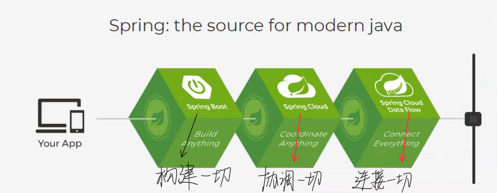
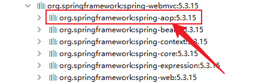
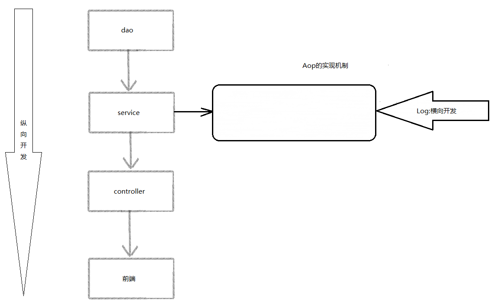
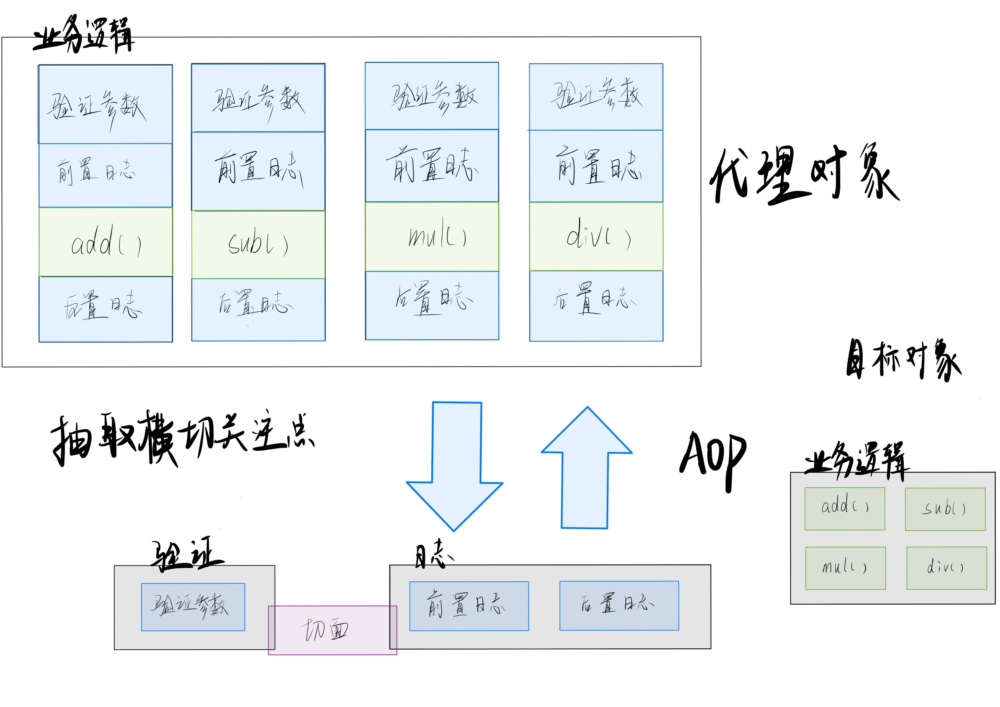
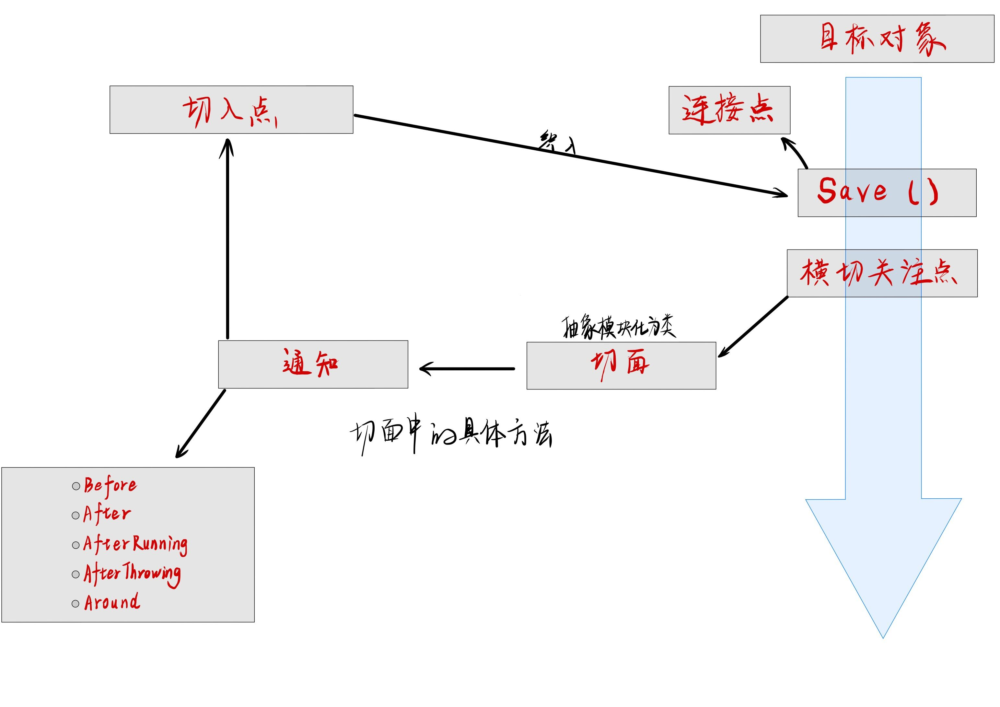
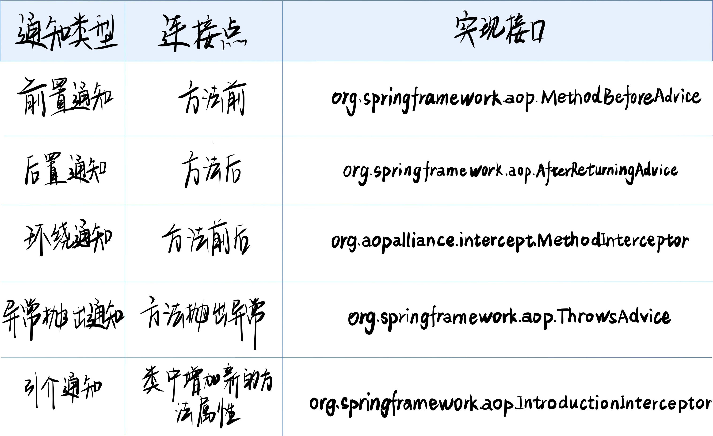

# 1、Spring

## 1.1  简介

* Spring：春天———> 给软件行业带来了春天！
* 2002，首次推出了Spring框架的雏形：interface21框架！
* Spring框架即以interface21框架为基础，经过重新设计，并不断丰富其内涵，于2004年3月24日，发布了1.0正式版。
* Rod Johnson， Spring Framework创始人，著名作者。很难想象Rod Johnson的学历，真的让好多人大吃一惊，他是悉尼大学的博士，然而他的专业不是计算机，而是音乐学。
* spring理念：使现有的技术更加容易使用，本身是一个大杂烩，整合了现有的技术框架！
* SSH： Struct2 + Spring + Hibernate
* SSM： SpringMvc + Spring + Mybatis！

官网：https://spring.io/projects/spring-framework#overview
		官方下载地址： http://repo.spring.io/release/org/springframework/spring
		GitHub： https://github.com/spring-projects/spring-framework


```xml
<!-- https://mvnrepository.com/artifact/org.springframework/spring-webmvc -->
<dependency>
    <groupId>org.springframework</groupId>
    <artifactId>spring-webmvc</artifactId>
    <version>5.3.15</version>
</dependency>

<!-- https://mvnrepository.com/artifact/org.springframework/spring-webmvc -->
<dependency>
    <groupId>org.springframework</groupId>
    <artifactId>spring-jdbc</artifactId>
    <version>5.3.15</version>
</dependency>
```

## 1.2 优点

* Spring 是一个开源的免费框架
* Spring是一个轻量级的、非入侵式的框架
* 控制反转(IOC)， 面向切片编程的(AOP)
* 支持事务的处理， 对框架整合的支持!

- 总结: Spring就是一个轻量级的控制反转和面向切片编程的框架!

## 1.3 组成


## 1.4 拓展

在Spring官网有这些的介绍：现代化的java开发



* Spring Boot
  * 一个快速的脚手架
  * 基于SpringBoot可以快速开发单个微服务
  * 约定大于配置
* Spring Cloud
  * SpringCloud是基于SpringBoot实现的
    因为现在大多数公司都在使用SpringBoot进行快速开发，学习SpringBoot的前提，需要完全掌握Spring及SpringMVC！承上启下的作用！

弊端：发展了太久之后，违背了原来的理念！配置十分繁琐，人称：“配置地狱”

# 2、IOC理论推导

	1. UserDao接口
	
	3. UserDaoImpl实现类
	
	4. UserService业务接口
	
	5. UserServiceImpl业务实现类

> 在我们之前的业务中， 用户的需求可能会影响我们原来的源代码，我们需要根据用户的需求去修改源代码！如果程序代码量十分大修改一次的成本十分昂贵！

我们使用一个Set接口实现，已经发生了革命性的变化！

```Java
Private UserDao userDao;

Public void setUserDao(UserDao userDao) {
	this.userDao = userDao;
}
```

* 之前程序是主动创建对象！控制权在程序员手上！
* 使用了set注入后， 程序不再具有主动性，而是变成了被动的接受对象！

这种思想在本质上解决了问题，程序员不用再去管理对象的创建了！系统的耦合性大大降低，可以更加专注的在业务的实现上！这是IOC的原型！


## 2.1 IOC本质

控制反转loC(Inversion of Control)，是一种设计思想，DI(依赖注入)是实现IoC的一种方法，也有人认为DI只是IoC的另一种说法。没有IoC的程序中，我们使用面向对象编程，对象的创建与对象间的依赖关系完全硬编码在程序中，对象的创建由程序自己控制，控制反转后将对象的创建转移给第三方，个人认为所谓控制反转就是：获得依赖对象的方式反转了。

采用XML方式配置Bean的时候，Bean的定义信息是和实现分离的，而采用注解的方式可以把两者合为一体，Bean的定义信息直接以注解的形式定义在实现类中，从而达到了零配置的目的。

控制反转是一种通过描述(XML或注解）并通过第三方去生产或获取特定对象的方式。在Spring中实现控制反转的是loC容器，其实现方法是依赖注入 (Dependency Injertion,DI)


# 3、HelloSpring


## 3.1.Set注入方式

原生java：
		类型 变量名 = new 类型();
	ex:Hello hello = new Hello();
Spring:
		id = 变量名
		class = new 的对象
		property 相当于给对象中的属性设置值

**Code:[[spring-02-hellospring]]**
<https://github.com/Haven-jiang/spring-study/tree/master/spring-02-hellospring>


```Java
package com.haven.pojo;

public class Hello {

    private String teststr;

    public String getTeststr() {
        return teststr;
    }

    public void setTeststr(String teststr) {
        this.teststr = teststr;
    }

    @Override
    public String toString() {
        return "Hello{" +
                "str='" + teststr + '\'' +
                '}';
    }
}
```


```xml
<?xml version="1.0" encoding="UTF-8"?>
<beans xmlns="http://www.springframework.org/schema/beans"
       xmlns:xsi="http://www.w3.org/2001/XMLSchema-instance"
       xsi:schemaLocation="http://www.springframework.org/schema/beans
        https://www.springframework.org/schema/beans/spring-beans.xsd">

        <!--使用Spring来创建对象, 在Spring中这些都称作Beans

        原来:
            类型 变量名 = new 类型();
            Hello hello = new hello();

        Spring:
            id = 变量名
            class = new 的对象
            property 相当于给对象中的属性设置一个值!

        -->

    <bean id="hello" class="com.haven.pojo.Hello">
        <property name="teststr" value="hello"/>
    </bean>

    <bean id="aloha" class="com.haven.pojo.Hello">
        <property name="teststr" value="aloha"/>
    </bean>
</beans>
```


```Java
import com.haven.pojo.Hello;
import org.springframework.context.ApplicationContext;
import org.springframework.context.support.ClassPathXmlApplicationContext;

public class MyTest {
    public static void main(String[] args) {
        // 获取Spring的上下文对象!
        ApplicationContext context = new ClassPathXmlApplicationContext("beans.xml");
        // 我们的对象现在都在Spring中的管理了,我们要使用,直接去里面取出来就可以!
        Hello hello = (Hello) context.getBean("hello");
        System.out.println(hello.getTeststr());
    }
}
```


## **3.2.About ApplicationContext:**


## 3.3.ref 和 value 的使用与区别

ref: 引用Spring容器中创建好的对象
value: 具体的值， 基本数据类型

[spring-01-ioc1]: https://github.com/Haven-jiang/spring-study/tree/master/spring-01-ioc1	"code"


```Xml
<?xml version="1.0" encoding="UTF-8"?>
<beans xmlns="http://www.springframework.org/schema/beans"
       xmlns:xsi="http://www.w3.org/2001/XMLSchema-instance"
       xsi:schemaLocation="http://www.springframework.org/schema/beans
        https://www.springframework.org/schema/beans/spring-beans.xsd">

    <bean id="mysql" class="com.haven.dao.UserDaoMysqlImpl"></bean>
    <bean id="oracle" class="com.haven.dao.UserDaoOracleImpl"></bean>
    <bean id="default" class="com.haven.dao.UserDaoImpl"></bean>

    <!--
    ref: 引用Spring容器中创建好的对象
    value: 具体的值,基本数据类型
    -->
    <bean id="service" class="com.haven.service.UserServiceImpl">
        <property name="userdao" ref="oracle"></property>
    </bean>

</beans>
```

控制：谁来控制对象的创建，传统应用程序的对象是由程序本身控制创建的，使用Spring后，对象是由Spring来创建的。

反转：程序本身不创建对象，而变成被动的接收对象。

依赖注入：就是利用set方法来进行注入的。

IoC是一种编程思想，由主动的编程变成被动的接收．
可以通过newClassPathxmlApplicationContext去浏览一下底层源码

**实现不同的操作不需要去改动源代码了， 只需要在xml配置文件中进行修改即可**


# 4、Spring配置

## 4.1. Import

For example:

```xml
    <import resource="beans.xml"/>
    <import resource="beans1.xml"/>
    <import resource="beans2.xml"/>
    <import resource="beans3.xml"/>
```

in ApplicationContext.xml

## 4.2. Alias

```xml
    <alias name="user1" alias="user10086"/>
```

## 4.3. Bean

* name:

```xml
    <bean id="user1" class="com.haven.pojo.User" name="u1,s1 u2;s2">
```


# 5、依赖注入


## 5.1 不同类型的数值注入


```java
class Student {
    private String name;
    private Address address;
    private String[] books;
    private List<String> hobbys;
    private Map<String, String> card;
    private Set<String> games;
    private boolean wife;
    private Properties info;
}
class Address {

    public String address;
}
```

```xml
    <bean id="address" class="com.Haven.pojo.Address">
        <property name="address" value="中国内蒙古自治区锡林郭勒盟"/>
    </bean>

    <bean id="studentinfo" class="com.Haven.pojo.Student">
        <property name="name" value="姜涵文"/>
        <constructor-arg ref="address"/>
        <property name="books">
            <array>
                <value>红楼梦</value>
                <value>三国演义</value>
                <value>西游记</value>
                <value>水浒传</value>
                <value>Java进阶</value>
                <value>JavaSpring</value>
            </array>
        </property>
        <property name="hobbys">
            <list>
                <value>听音乐</value>
                <value>打篮球</value>
                <value>写代码</value>
                <value>女</value>
            </list>
        </property>
        <property name="card">
            <map>
                <entry key="peopleID" value="152325200909134014"/>
                <entry key="cardID" value="6217370060200164010"/>
            </map>
        </property>
        <property name="games">
            <set>
                <value>LOL</value>
                <value>COC</value>
                <value>BOB</value>
                <value>GRUB</value>
            </set>
        </property>
        <property name="wife" value="true"/>
        <property name="info">
            <props>
                <prop key="id">1315672572</prop>
                <prop key="key">aabbcccdddd123</prop>
            </props>
        </property>
    </bean>
```

[beans.xml](https://gitee.com/just-holdway/spring-study/raw/master/spring-04-di/src/main/resources/beans.xml)

**Collections**

The `<list/>`, `<set/>`, `<map/>`, and `<props/>` elements set the properties and arguments of the Java `Collection` types `List`, `Set`, `Map`, and `Properties`, respectively. The following example shows how to use them:

```xml
<bean id="moreComplexObject" class="example.ComplexObject">
    <!-- results in a setAdminEmails(java.util.Properties) call -->
    <property name="adminEmails">
        <props>
            <prop key="administrator">administrator@example.org</prop>
            <prop key="support">support@example.org</prop>
            <prop key="development">development@example.org</prop>
        </props>
    </property>
    <!-- results in a setSomeList(java.util.List) call -->
    <property name="someList">
        <list>
            <value>a list element followed by a reference</value>
            <ref bean="myDataSource" />
        </list>
    </property>
    <!-- results in a setSomeMap(java.util.Map) call -->
    <property name="someMap">
        <map>
            <entry key="an entry" value="just some string"/>
            <entry key="a ref" value-ref="myDataSource"/>
        </map>
    </property>
    <!-- results in a setSomeSet(java.util.Set) call -->
    <property name="someSet">
        <set>
            <value>just some string</value>
            <ref bean="myDataSource" />
        </set>
    </property>
</bean>
```

The value of a map key or value, or a set value, can also be any of the following elements:

```xml
bean | ref | idref | list | set | map | props | value | null
```

**Collection Merging**

The Spring container also supports merging collections. An application developer can define a parent `<list/>`,`<map/>`,`<set/>` or `<props/>` element and have child `<list/>`,`<map/>`,`<set/>` or `<props/>` elements inherit and override values from the parent collection. That is, the child collection's values are the result of merging the elements of the parent and child collections, with the child's collection elements overriding values specified in the parent collection.

This section on merging discusses the parent-child bean mechanism. Readers unfamiliar with parent and child bean definitions may wish to read the relevant section before continuing.

The following example demonstrates collection merging:

```xml
<beans>
    <bean id="parent" abstract="true" class="example.ComplexObject">
        <property name="adminEmails">
            <props>
                <prop key="administrator">administrator@example.com</prop>
                <prop key="support">support@example.com</prop>
            </props>
        </property>
    </bean>
    <bean id="child" parent="parent">
        <property name="adminEmails">
            <!-- the merge is specified on the child collection definition -->
            <props merge="true">
                <prop key="sales">sales@example.com</prop>
                <prop key="support">support@example.co.uk</prop>
            </props>
        </property>
    </bean>
<beans>
```

Notice the use of the `merge=true` attribute on the element of the `<props/> adminEmails` property of the bean definition. When the bean is `child child` resolved and instantiated by the container, the resulting instance has an collection that contains the result of merging the child's collection. The following listing shows the result: `adminEmails Properties adminEmails adminEmails`

```
administrator=administrator@example.com
sales=sales@example.com
support=support@example.co.uk
```


## 5.2 构造器注入


* **使用无参构造函数创建对象， 默认！**

* **使用有参构造函数创建对象。**


### 5.2.1 第一种injection方式(Constructor Argument Resolution)


Constructor-based DI is accomplished by the container invoking a constructor with a number of arguments, each representing a dependency. Calling a static factory method with specific arguments to construct the bean is nearly equivalent, and this discussion treats arguments to a constructor and to a static factory method similarly. The following example shows a class that can only be dependency-injected with constructor injection:

```Java
public class SimpleMovieLister {

    // the SimpleMovieLister has a dependency on a MovieFinder
    private final MovieFinder movieFinder;

    // a constructor so that the Spring container can inject a MovieFinder
    public SimpleMovieLister(MovieFinder movieFinder) {
        this.movieFinder = movieFinder;
    }

    // business logic that actually uses the injected MovieFinder is omitted...
}
```

Notice that there is nothing special about this class. It is a POJO that has no dependencies on container specific interfaces, base classes, or annotations.

```xml
    <!--第一种方式 类中类赋值-->
    <bean id="user4" class="com.haven.pojo.User">
        <constructor-arg ref="op1"/>
    </bean>
    <bean id="op1" class="com.haven.pojo.User">
        <property name="ptr" value="none"/>
    </bean>
```

Constructor argument resolution matching occurs by using the argument’s type. If no potential ambiguity exists in the constructor arguments of a bean definition, the order in which the constructor arguments are defined in a bean definition is the order in which those arguments are supplied to the appropriate constructor when the bean is being instantiated. Consider the following class:

```Java
package x.y;

public class ThingOne {

    public ThingOne(ThingTwo thingTwo, ThingThree thingThree) {
        // ...
    }
}
```

Assuming that the ThingTwo and ThingThree classes are not related by inheritance, no potential ambiguity exists. Thus, the following configuration works fine, and you do not need to specify the constructor argument indexes or types explicitly in the <constructor-arg/> element.

```xml
<beans>
    <bean id="beanOne" class="x.y.ThingOne">
        <constructor-arg ref="beanTwo"/>
        <constructor-arg ref="beanThree"/>
    </bean>

    <bean id="beanTwo" class="x.y.ThingTwo"/>

    <bean id="beanThree" class="x.y.ThingThree"/>
</beans>
```


### 5.2.2 第二种赋值方式(Constructor argument type matching)


```xml
    <!--第二种 参数类型赋值  不建议使用-->
    <bean id="user2" class="com.haven.pojo.User">
        <constructor-arg type="java.lang.String" value="王刚"/>
    </bean>
```

When another bean is referenced, the type is known, and matching can occur (as was the case with the preceding example). When a simple type is used, such as <value>true</value>, Spring cannot determine the type of the value, and so cannot match by type without help. Consider the following class:

```Java
package examples;

public class ExampleBean {

    // Number of years to calculate the Ultimate Answer
    private final int years;

    // The Answer to Life, the Universe, and Everything
    private final String ultimateAnswer;

    public ExampleBean(int years, String ultimateAnswer) {
        this.years = years;
        this.ultimateAnswer = ultimateAnswer;
    }
}
```

```xml
<constructor-arg type="int" value="7500000"/>
```

In the preceding scenario, the container can use type matching with simple types if you explicitly specify the type of the constructor argument by using the type attribute, as the following example shows:

```xml
<bean id="exampleBean" class="examples.ExampleBean">
    <constructor-arg type="int" value="7500000"/>
    <constructor-arg type="java.lang.String" value="42"/>
</bean>
```


### 5.2.3.第三种注入方式(Constructor argument index)


```xml
    <!--第三种 下标赋值-->
    <bean id="user1" class="com.haven.pojo.User" name="u1,s1 u2;s2">
        <constructor-arg index="0" value="王刚10086"/>
    </bean>
```

You can use the index attribute to specify explicitly the index of constructor arguments, as the following example shows:

```xml
<bean id="exampleBean" class="examples.ExampleBean">
    <constructor-arg index="0" value="7500000"/>
    <constructor-arg index="1" value="42"/>
</bean>
In addition to resolving the ambiguity of multiple simple values, specifying an index resolves ambiguity where a constructor has two arguments of the same type.
```

The index is 0-based.


### 5.2.4.第四种注入方式(Constructor argument name)


```xml
    <!--第四种方式 直接通过参数名赋值-->
    <bean id="user3" class="com.haven.pojo.User">
        <constructor-arg name="name" value="王刚"/>
    </bean>
```

You can also use the constructor parameter name for value disambiguation, as the following example shows:

```xml
<bean id="exampleBean" class="examples.ExampleBean">
    <constructor-arg name="years" value="7500000"/>
    <constructor-arg name="ultimateAnswer" value="42"/>
</bean>
```

# 


## 5.3 XML Shortcut with the p-namespace and c-namespace


### 5.3.1. p-namespace


The p-namespace lets you use the element’s attributes (instead of nested elements) to describe your property values collaborating beans, or both.`bean<property/>`

Spring supports extensible configuration formats with namespaces, which are based on an XML Schema definition. The configuration format discussed in this chapter is defined in an XML Schema document. However, the p-namespace is not defined in an XSD file and exists only in the core of Spring.`beans`

The following example shows two XML snippets (the first uses standard XML format and the second uses the p-namespace) that resolve to the same result:


```xml
<beans xmlns="http://www.springframework.org/schema/beans"
    xmlns:xsi="http://www.w3.org/2001/XMLSchema-instance"
    xmlns:p="http://www.springframework.org/schema/p"
    xsi:schemaLocation="http://www.springframework.org/schema/beans
        https://www.springframework.org/schema/beans/spring-beans.xsd">

    <bean name="classic" class="com.example.ExampleBean">
        <property name="email" value="someone@somewhere.com"/>
    </bean>

    <bean name="p-namespace" class="com.example.ExampleBean"
        p:email="someone@somewhere.com"/>
</beans>
```


The example shows an attribute in the p-namespace called in the bean definition. This tells Spring to include a property declaration. As previously mentioned, the p-namespace does not have a schema definition, so you can set the name of the attribute to the property name.`email`

This next example includes two more bean definitions that both have a reference to another bean:


```xml
<beans xmlns="http://www.springframework.org/schema/beans"
    xmlns:xsi="http://www.w3.org/2001/XMLSchema-instance"
    xmlns:p="http://www.springframework.org/schema/p"
    xsi:schemaLocation="http://www.springframework.org/schema/beans
        https://www.springframework.org/schema/beans/spring-beans.xsd">

    <bean name="john-classic" class="com.example.Person">
        <property name="name" value="John Doe"/>
        <property name="spouse" ref="jane"/>
    </bean>

    <bean name="john-modern"
        class="com.example.Person"
        p:name="John Doe"
        p:spouse-ref="jane"/>

    <bean name="jane" class="com.example.Person">
        <property name="name" value="Jane Doe"/>
    </bean>
</beans>
```


This example includes not only a property value using the p-namespace but also uses a special format to declare property references. Whereas the first bean definition uses to create a reference from bean to bean , the second bean definition uses as an attribute to do the exact same thing. In this case, is the property name, whereas the part indicates that this is not a straight value but rather a reference to another bean.`<property name="spouse" ref="jane"/>johnjanep:spouse-ref="jane"spouse-ref`


> The p-namespace is not as flexible as the standard XML format. For example, the format for declaring property references clashes with properties that end in , whereas the standard XML format does not. We recommend that you choose your approach carefully and communicate this to your team members to avoid producing XML documents that use all three approaches at the same time. `Ref`


### 5.3.2 c-namespace


Similar to the XML Shortcut with the p-namespace, the c-namespace, introduced in Spring 3.1, allows inlined attributes for configuring the constructor arguments rather then nested elements.`constructor-arg`

The following example uses the namespace to do the same thing as the from Constructor-based Dependency Injection:`c:`


```xml
<beans xmlns="http://www.springframework.org/schema/beans"
    xmlns:xsi="http://www.w3.org/2001/XMLSchema-instance"
    xmlns:c="http://www.springframework.org/schema/c"
    xsi:schemaLocation="http://www.springframework.org/schema/beans
        https://www.springframework.org/schema/beans/spring-beans.xsd">

    <bean id="beanTwo" class="x.y.ThingTwo"/>
    <bean id="beanThree" class="x.y.ThingThree"/>

    <!-- traditional declaration with optional argument names -->
    <bean id="beanOne" class="x.y.ThingOne">
        <constructor-arg name="thingTwo" ref="beanTwo"/>
        <constructor-arg name="thingThree" ref="beanThree"/>
        <constructor-arg name="email" value="something@somewhere.com"/>
    </bean>

    <!-- c-namespace declaration with argument names -->
    <bean id="beanOne" class="x.y.ThingOne" c:thingTwo-ref="beanTwo"
        c:thingThree-ref="beanThree" c:email="something@somewhere.com"/>

</beans>
```


The namespace uses the same conventions as the one (a trailing for bean references) for setting the constructor arguments by their names. Similarly, it needs to be declared in the XML file even though it is not defined in an XSD schema (it exists inside the Spring core).`c:p:-ref`

For the rare cases where the constructor argument names are not available (usually if the bytecode was compiled without debugging information), you can use fallback to the argument indexes, as follows:


```xml
<!-- c-namespace index declaration -->
<bean id="beanOne" class="x.y.ThingOne" c:_0-ref="beanTwo" c:_1-ref="beanThree"
    c:_2="something@somewhere.com"/>
```

> 
>
> Due to the XML grammar, the index notation requires the presence of the leading , as XML attribute names cannot start with a number (even though some IDEs allow it). A corresponding index notation is also available for elements but not commonly used since the plain order of declaration is usually sufficient there. `_<constructor-arg>`


In practice, the constructor resolution mechanism is quite efficient in matching arguments, so unless you really need to, we recommend using the name notation throughout your configuration.


## 5.4 bean的作用域


| Scope                                                        | Description                                                  |
| :----------------------------------------------------------- | :----------------------------------------------------------- |
| [singleton](https://docs.spring.io/spring-framework/docs/current/reference/html/core.html#beans-factory-scopes-singleton) | (Default) Scopes a single bean definition to a single object instance for each Spring IoC container. |
| [prototype](https://docs.spring.io/spring-framework/docs/current/reference/html/core.html#beans-factory-scopes-prototype) | Scopes a single bean definition to any number of object instances. |
| [request](https://docs.spring.io/spring-framework/docs/current/reference/html/core.html#beans-factory-scopes-request) | Scopes a single bean definition to the lifecycle of a single HTTP request. That is, each HTTP request has its own instance of a bean created off the back of a single bean definition. Only valid in the context of a web-aware Spring `ApplicationContext`. |
| [session](https://docs.spring.io/spring-framework/docs/current/reference/html/core.html#beans-factory-scopes-session) | Scopes a single bean definition to the lifecycle of an HTTP `Session`. Only valid in the context of a web-aware Spring `ApplicationContext`. |
| [application](https://docs.spring.io/spring-framework/docs/current/reference/html/core.html#beans-factory-scopes-application) | Scopes a single bean definition to the lifecycle of a `ServletContext`. Only valid in the context of a web-aware Spring `ApplicationContext`. |
| [websocket](https://docs.spring.io/spring-framework/docs/current/reference/html/web.html#websocket-stomp-websocket-scope) | Scopes a single bean definition to the lifecycle of a `WebSocket`. Only valid in the context of a web-aware Spring `ApplicationContext`. |

| !    | As of Spring 3.0, a thread scope is available but is not registered by default. For more information, see the documentation for [`SimpleThreadScope`](https://docs.spring.io/spring-framework/docs/5.3.15/javadoc-api/org/springframework/context/support/SimpleThreadScope.html). For instructions on how to register this or any other custom scope, see [Using a Custom Scope](https://docs.spring.io/spring-framework/docs/current/reference/html/core.html#beans-factory-scopes-custom-using). |
| ---- | ------------------------------------------------------------ |


### 5.4.1. The Singleton Scope(单例模式 默认)


```xml
<bean id="accountService" class="com.something.DefaultAccountService"/>

<!-- the following is equivalent, though redundant (singleton scope is the default) -->
<bean id="accountService" class="com.something.DefaultAccountService" scope="singleton"/>
```


### 5.4.2. The Prototype Scope (原型模式)


```xml
<bean id="accountService" class="com.something.DefaultAccountService" scope="prototype"/>
```

**每次从容其中get的时候, 都会产生一个新对象!**


### 5.4.3. 其余的request,session,application

**只能在Web开发中使用到!**


# 6、Bean的自动装配


* 自动装配Spring满足bean依赖一种方式!
* Spring会在上下文中自动寻找,并自动给bean装配属性!


在Spring中有三种装配的方式

	1. 在xml中显示的配置
	1. 在java 中显示配置
	1. 隐式的自动装配bean[重要]


## 6.1 测试

环境搭建:一个人有两个宠物


## 6.2 ByName自动装配

```xml
	<bean id="cat" class="com.Haven.pojo.Cat"/>
	<bean id="dog" class="com.Haven.pojo.Dog"/>
	<!--
		byName: 会自动在容器上下文下文中查找, 和自己对象set方法后面的值对应的beanID!
	-->
	<bean id="people" class="com.Haven.pojo.People" autowire="byType" p:name="Haven"/>
```

## 6.3 ByType自动装配

```xml
    <bean class="com.Haven.pojo.Cat"/>
    <bean class="com.Haven.pojo.Dog"/>
    <!--
    	byName: 会自动在容器上下文下文中查找, 和自己对象set方法后面的数据类型形同的bean!
    -->
    <bean id="people" class="com.Haven.pojo.People" autowire="byType" p:name="Haven"/>
```

小结:

* byname的时候, 需要保证所有的bean的id唯一, 并且这个bean需要和自动注入的属性的set方法值一致!
* bytype的时候, 需要保证所有的bean的class唯一, 并且这个bean需要和自动注入的属性的set的类型与数量一致!

## 6.4 使用注解自动装配

jdk1.5支持的注解, Spring2.5就支持注解了!

The introduction of annotation-based configuration raised the question of whether this approach is “better” than XML. 

1. 导入约束 [xmlns:context="http://www.springframework.org/schema/context"](xml)
2. 配置注解的支持 [<context:annotation-config/>](xml)

```xml
<?xml version="1.0" encoding="UTF-8"?>
<beans xmlns="http://www.springframework.org/schema/beans"
    xmlns:xsi="http://www.w3.org/2001/XMLSchema-instance"
    xmlns:context="http://www.springframework.org/schema/context"
    xsi:schemaLocation="http://www.springframework.org/schema/beans
        https://www.springframework.org/schema/beans/spring-beans.xsd
        http://www.springframework.org/schema/context
        https://www.springframework.org/schema/context/spring-context.xsd">

    <context:annotation-config/>

</beans>
```


**@Autowired**

直接在属性上使用即可! 也可以在set方式上使用!

使用Autowried我们可以不用编写Set方式了, 前提是你这个自动装配的属性在IOC(Spring)容器中存在, 且符合类型bytype!

科普:

```java
@Nullable //字段标记了这个注解, 说明这个字段可以为null
```

```java
public @interface Autowired {
    boolean required() default true;
}
```

测试代码

```java
public class People {
    //如果显示定义了Autowired的required属性为false, 说明这个对象可以为null, 否则不允许为空
    @Autowired(required = false)
    public Cat cat;
    @Autowired
    public Dog dog;
    public String name;
}
```


如果@Autowired自动装配的环境比较复杂, 自动装配无法通过一个注解[@Autowired]完成的时候, 我们可以使用@Qualifier(value = "xxx")去配置@Autowired的使用, 指定一个唯一的bean对象注入!


```java
public class People {
    
    //如果显示定义了Autowired的required属性为false, 说明这个对象可以为null, 否则不允许为空
    
    @Autowired(required = false)
    @Qualifier(value = "cat1")
    public Cat cat;
    
    @Autowired
    @Qualifier(value = "dog1")
    public Dog dog;
    public String name;
    
}

```

**@Resource注解** //已弃用

```java
public class People {
    @Resource(name="cat2")
    private Cat cat;
    @Resource
    private Dog dog;
}
```

小结:

@Resource和@Autowired的区别:

* 都是用来自动装配的, 都可以放在属性字段上
* @Autowired 先通过bytype的方式实现, 如果类型与数量不匹配, 则通过byName实现! (必须存在)
* @Resource 先通过byname的方式实现, 如果找不到这个名字, 则通过byType实现! 找不到就报错!
* 执行顺序不同: @Autowired 通过 byType 的方式实现. @Resource 默认通过byname的方式实现.


# 7、使用注解开发


在Spring4之后, 要使用注解开发, 必须要保证aop的包导入了



使用注解需要导入context约束, 增加注解的支持!

```xml
<?xml version="1.0" encoding="UTF-8"?>
<beans xmlns="http://www.springframework.org/schema/beans"
    xmlns:context="http://www.springframework.org/schema/context"
    xmlns:xsi="http://www.w3.org/2001/XMLSchema-instance"
    xsi:schemaLocation="http://www.springframework.org/schema/beans
    http://www.springframework.org/schema/context
    https://www.springframework.org/schema/context/spring-context.xsd
    https://www.springframework.org/schema/beans/spring-beans.xsd">
    
    <context:annotation-config/>
</beans>
```


1. bean

   

2. 属性如何注入

   ```xml
   @Component //等价于 <bean id="user" class="com.Haven.pojo.User"/>
   public class User {
   
       @Value("Haven") //相当于 <property name="name" value="Haven"/>
       public String name;
   
       public void setName(String name) {
           this.name = name;
       }
   }
   ```

   

3. 衍生的注解

   @Component 有几个衍生注解, 我们在web开发中, 会按照mvc三层架构分层!

   - dao [@Repository]

   - service [@Service]

   - controller [@Controller]

     这四个注解功能都是一样的, 都是代表将某个类注册到Spring中, 装配bean

4. 自动装配置

   ```xml
   - @Autowired: 自动装配通过 type->name
       如果Autowired不能唯一自动装配上属性, 则需要通过@Qualifier(value="xxx")
   - @Nullable : 字段标记了这个注解, 说明这个字段可以为null
   - @Resource : 自动装配通过 name->type
   ```

5. 作用域

   ```java
   @Component //等价于 <bean id="user" class="com.Haven.pojo.User"/>
   @Scope("prototype")
   public class User {
   
       public String name;
   
       @Value("Haven") //相当于 <property name="name" value="Haven"/>
       public void setName(String name) {
           this.name = name;
       }
   }
   ```

6. 小结

   xml 与 注解:

   - xml 更加万能, 适用于任何场合! 维护简单方便
   - 注解 不是自己类使用不了, 维护相对复杂!
   
   xml 与 注解最佳实践: 
   
   - xml 用来管理bean;
   - 注解只负责完成属性注入;
   - 我们在使用的过程中, 只需要注意一个问题: 必须让注解生效, 就需要开启注解的支持;
   
   ```xml
       <!--指定要扫描的包, 这个包下的注解就会生效-->
       <context:component-scan base-package="com.Haven"/>
       <context:annotation-config/>
   ```


# 8、使用Java的方式配置Spring

我们现在要完全不适用Spring的xml配置了, 全权交给java来做!

JavaConfig 是Spring的一个子项目, 在Spring 4 之后, 他成为了一个核心功能.

实体类:

```java
//这里这个注解的意思, 就是说明这个类被Spring接管了, 注册到了容器中
@Component
public class User {

    @Value("Haven") // 属性注入值
    public String name;

    public String getName() {
        return name;
    }

    public void setName(String name) {
        this.name = name;
    }

    @Override
    public String toString() {
        return "User{" +
                "name='" + name + '\'' +
                '}';
    }
}
```

配置文件:

```java
@Configuration //这个也会Spring容器托管, 注册到容器中,因为他本来就是一个@Component. @Configuration代表这是一个配置类就和我们之前看的beans.xml
@ComponentScan("com.Haven.pojo")
@Import(AppConfig1.class)
public class AppConfig {

    //注册一个bean, 这就相当与我们之前写的一个bean标签
    //这个方法的名字, 就相当于bean标签中的id属性
    //这个方法的返回值, 就相当于bean标签中的class属性
    @Bean
    public User user() {
        return new User();//就是返回要注入到bean的对象!
    }
}
```

测试类:

```java
public class MyTest {
    public static void main(String[] args) {
        //如果完全使用了配置类方式去做, 我们就只能通过 AnnotationConfig 上下文来获取容器, 通过配置类的class对象加载!
        ApplicationContext context = new AnnotationConfigApplicationContext(AppConfig.class);
        User bean = context.getBean("user", User.class);
        System.out.println(bean);
    }
}
```

这种纯Java的配置方式, 在 Spring Boot 中随处可见!

# 9、代理模式

为什么要学习代理模式?因为这就是SpringAOP的底层![SpringAOP 和 SpringMVC]
代理模式的分类:
- 静态代理
- 动态代理

## 9.1 静态代理
角色分析:
- 抽象角色:一般会使用接口或者抽象类来解决
- 真实角色:被代理的角色
- 代理角色:代理真实角色, 代理真实角色后, 我们一般会做一些附属操作
- 客户:访问对象的人!

代码步骤:
1. 接口
```java
//租房
public interface Rent {
    public void rent();
}
```
2. 真实角色
```java
//房东
public class Host implements Rent {
    @Override
    public void rent() {
        System.out.println("房东要出租房子");
    }
}
```
3. 代理角色
```java
public class Proxy implements Rent {
    private Host host;

    public Proxy() {
    }

    public Proxy(Host host) {
        this.host = host;
    }

    @Override
    public void rent() {
        seeHouse();
        host.rent();
        heTong();
        fare();
    }

    //看房
    public void seeHouse() {
        System.out.println("中介带你看房");
    }

    //合同
    public void heTong() {
        System.out.println("签租赁合同");
    }

    //收中介费
    public void fare() {
        System.out.println("收中介费");
    }
}
```
4. 客户端访问代理角色
```java
public class Client {
    public static void main(String[] args) {
        //房东要租房子
        Host host = new Host();
        //正常
        //host.rent();
        //代理,中介帮房东租房子,但是?代理角一般会有一般会有一些附属操作!
        Proxy proxy = new Proxy(host);
        //你不用面对房东,直接找中介租房即可!
        proxy.rent();
    }
}
```

代理模式的好处:
- 可以使真实角色的操作更加纯粹!不用去关注一些公共的业务
- 公共也就交给代理角色!实现了业务的分工!
- 公共业务发生扩展的时候, 方便集中管理!
缺点:
- 一个真实角色就会产生一个代理角色;代码量会翻倍 开发效率会变低

## 10.2 加深理解

代码: file:spring-08-proxy


## 10.3 动态代理
- 动态代理和静态代理角色一样
- 动态代理的代理类是动态生成的, 不是我们直接写好的!
- 动态代理分为两大类: 基于接口的动态代理, 基于类的动态代理
  - 基于接口 -- JDK动态代理
  - 基于类 -- cglib
  - java字节码实现 -- javassist

需要了解两个类: Proxy: 代理, InvocationHandler: 调用处理程序


动态代理的好处:

- 可以使真实角色的操作更加纯粹! 不用去关注一些公共的业务
- 公共也就交给代理角色 实现了业务的分工
- 公共业务发生扩展的时候 方便集中管理
- 一个动态代理类代理的是一个接口 一般就是对应的一类业务
- 一个动态类可以代理多个类 只要是实现了同一个接口就行


# 10、AOP

## 10.1 什么是AOP

AOP(Aspect Oriented Programming) 意为: 面向切片编程, 通过预编译方式和运行期动态代理实现程序功能的统一维护的一种技术. AOP是OOP的延续, 是软件开发中的一个热点, 也是Spring框架中的一个重要内容, 是函数式编程的一种衍生泛型. 利用AOP可以对业务逻辑的各个部分进行隔离,从而使得业务逻辑各部分之间的耦合度降低, 提高程序的可重用性, 同时提高了开发效率.



## 10.2 AOP在Spring中的作用

==提供声明式服务; 允许用户自定义切面==

- 横切关注点: 跨越应用程序多个模块的方法或功能. 即是, 与我们业务逻辑无关的, 但是我们需要关注的部分, 就是横切关注点. 如日志, 安全, 缓存, 事务等等…
- 切面(Aspect): 横切关注点 被模块化 的特殊对象. 即, 他是一个类.
- 通知(Advice): 切面必须要完成的工作, 即 它是类中的一个方法.
- 目标(Target): 被通知对象.
- 代理(Proxy): 向目标对象应用通知之后创建的对象.
- 切入点(PointCut): 切面通知 执行的“地点”的定义.
- 连接点(JionPoint): 与切入点匹配的支持点.



SpringAOP中, 通过Advice定义横切逻辑, 去增加新的功能.



即AOP在 不改变原有代码的情况下, 去增加新的功能.


## 11.3 使用Spring实现AOP

[重点]使用AOP织入, 需要导入一个依赖包!

```xml
<!-- https://mvnrepository.com/artifact/org.aspectj/aspectjweaver -->
<dependency>
	<groupId>org.aspectj</groupId>
	<artifactId>aspectjweaver</artifactId>
	<version>1.9.8</version>
</dependency>
```

方式一: 使用Spring的API接口